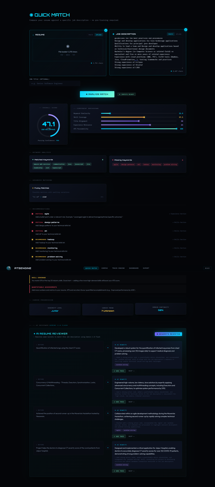
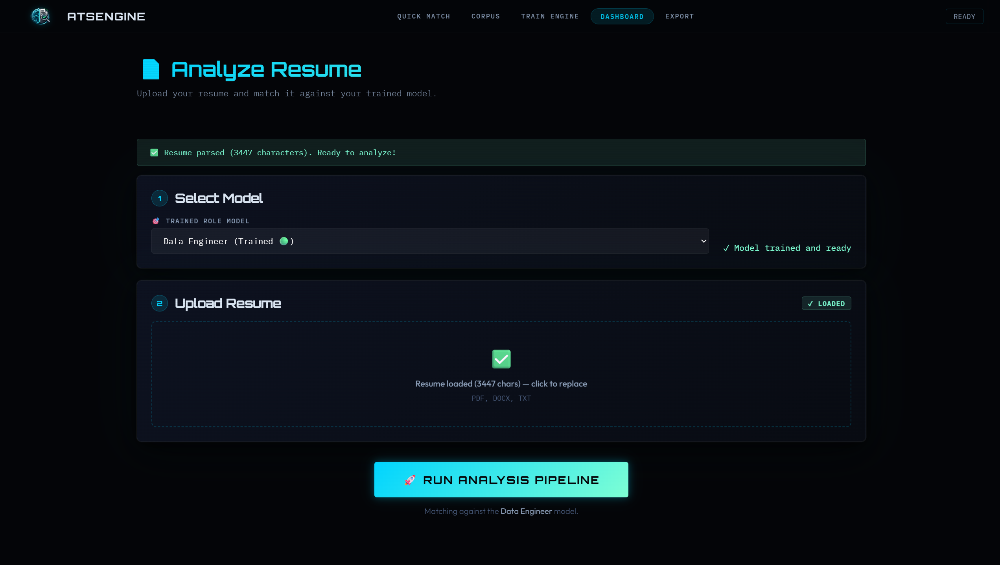
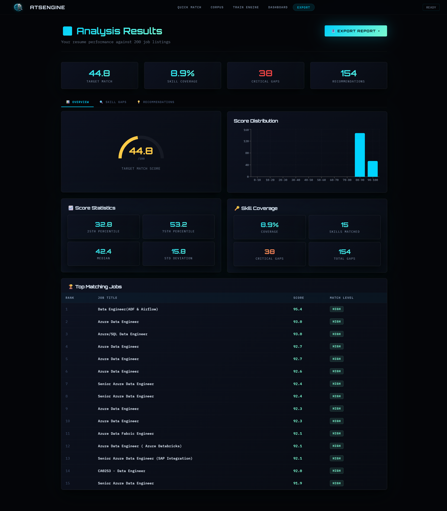
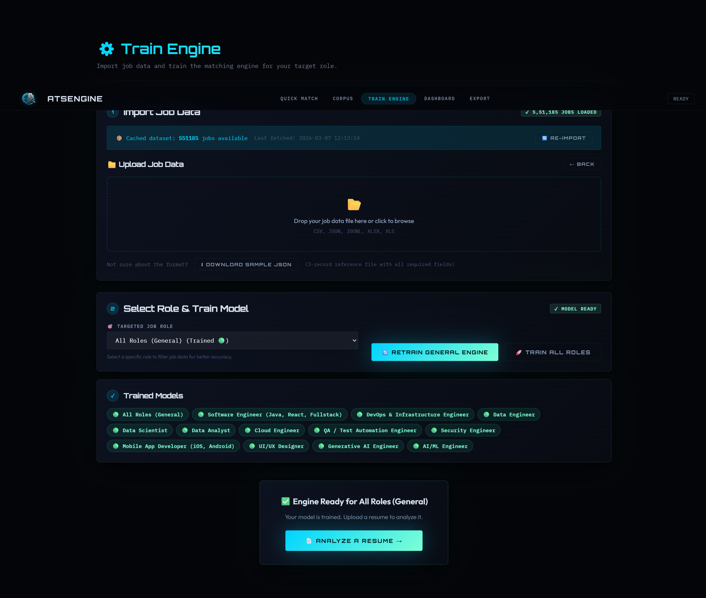

<div align="center">
  
</div>

# 🧠 Resume-Job Matching & ATS Optimization Engine


> **The smartest resume filter you'll ever face — now working for YOU instead of against you.**

---

## � Visual Overview

````carousel

<!-- slide -->

<!-- slide -->

<!-- slide -->

<!-- slide -->

<!-- slide -->

````

---

## �🔗 Quick Links

| Resource | URL |
|---|---|
| **Live Demo** | https://resume-job-matching-ats-optimizatio.vercel.app/ |
| **GitHub** | https://github.com/Dinesh-Das/resume-job-matching-ats-optimization-engine |
| **Backend** (Hugging Face) | Deploy via `Dockerfile` — see Section 9 |

---

## 📋 Table of Contents

1. [What Is This? (The Elevator Pitch)](#1-what-is-this)
2. [Live Demo & Quick Start](#2-live-demo--quick-start)
3. [How It Works — The Full Journey of a Resume](#3-how-it-works)
   - 3.1 Resume Ingestion & Parsing
   - 3.2 Text Cleaning & NLP Pipeline
   - 3.3 Skill Extraction
   - 3.4 TF-IDF Vectorization
   - 3.5 Semantic Similarity
   - 3.6 ATS Simulation
   - 3.7 Composite Scoring
   - 3.8 Gap Analysis
   - 3.9 Recommendations
   - 3.10 AI Resume Reviewer
4. [Training Pipeline Deep Dive](#4-training-pipeline-deep-dive)
5. [Architecture & System Design](#5-architecture--system-design)
6. [API Reference](#6-api-reference)
7. [Hardware Optimization & Performance](#7-hardware-optimization--performance)
8. [Frontend — Antigravity Design System](#8-frontend--antigravity-design-system)
9. [Deployment](#9-deployment)
10. [Configuration Reference](#10-configuration-reference)
11. [How the Score Is Calculated — Visual Summary](#11-how-the-score-is-calculated)

---

## 1. What Is This?

### 🗣️ For Job Seekers & Recruiters (Plain English)

Think of this as a super-smart filter that reads your resume the same way a company's computer would — and tells you **exactly why you passed or failed**, then helps you fix it.

When you apply for a job at a big company, your resume almost never goes directly to a human. It first gets scanned by software called an **ATS (Applicant Tracking System)** — essentially a robot that looks for keywords, checks formatting, and scores you before a recruiter even glances at your name. Most applicants are eliminated at this stage without ever knowing why.

This engine is your **personal ATS simulator and coach**. Upload your resume and a job description, and it will:

1. **Read your resume** the same way the robot does — trying multiple techniques to extract your text, including OCR for scanned PDFs.
2. **Score your match** against the job description across 6 dimensions: keyword overlap, skill coverage, title alignment, experience relevance, ATS formatting quality, and semantic meaning.
3. **Tell you exactly what's missing** — ranking gaps as Critical (must-have), Recommended (nice-to-have), or Optional.
4. **Give you a hit-list of fixes** — where to add each missing skill, and how to phrase it.
5. **Optionally rewrite your weakest bullet points** using Google's Gemini AI, transforming vague descriptions into specific, metric-driven achievements.

Train it on 439,100 real job descriptions and it becomes even more powerful — understanding what skills employers in your target role actually care about, ranked by how often they appear across the industry.

---

### ⚙️ For Technical Architects (Implementation Overview)

This is a **full-stack ML-powered document analysis pipeline** built with:

- **Backend**: FastAPI (Python 3.10), multi-engine PDF parsing, spaCy NLP, TF-IDF vectorization, sentence-transformers semantic similarity, joblib parallel processing, optional GPU acceleration via CuPy/CUDA.
- **Frontend**: React 18 + Vite, custom "Antigravity" dark design system, SVG ScoreRing component, AbortController network resilience.
- **ML Models**: `en_core_web_sm` (spaCy lemmatization), `all-MiniLM-L6-v2` (sentence-transformers semantic similarity), `gemini-2.5-flash` (AI bullet rewriting).
- **Data Source**: Oracle Database (`JOBDETAILS` table, 545,496 raw records → 439,100 after dedup/validation).
- **Deployment**: Vercel (frontend) + Hugging Face Spaces Docker (backend, 16 GB RAM free tier).

The system supports two primary modes:
1. **Quick Match** — Stateless 1:1 resume vs. JD comparison. No pre-training required. 11.3 seconds end-to-end.
2. **Corpus Mode** — Resume scored against a trained model built from 439,100 job descriptions. Provides industry-calibrated gap analysis.

---

## 2. Live Demo & Quick Start

### 🌐 Try It Now

```
https://resume-job-matching-ats-optimizatio.vercel.app/
```

The live demo runs the full pipeline. For Quick Match, no data upload is needed — just paste your resume and a job description.

---

### 🛠️ Local Development Setup

#### Prerequisites

| Dependency | Version | Purpose |
|---|---|---|
| Python | 3.10+ | Backend runtime |
| Node.js | 18+ | Frontend build |
| Tesseract OCR | 4.x | Scanned PDF fallback |
| Poppler | Latest | PDF-to-image (for OCR) |

#### Step 1: Clone & Backend Setup

```bash
git clone https://github.com/Dinesh-Das/resume-job-matching-ats-optimization-engine.git
cd resume-job-matching-ats-optimization-engine

# Install Python dependencies
pip install -r requirements.txt

# Download spaCy model
python -m spacy download en_core_web_sm

# (Optional) Install Tesseract for scanned PDF support
# Ubuntu/Debian:
sudo apt-get install tesseract-ocr poppler-utils
# Windows: download installer from https://github.com/UB-Mannheim/tesseract/wiki
```

#### Step 2: Environment Variables

Create a `.env` file in the project root:

```env
# Required for AI bullet rewriting (free tier available)
GEMINI_API_KEY=your_gemini_api_key_here

# Optional: Oracle DB connection (only if you have a real Oracle instance)
# ORACLE_HOST=localhost
# ORACLE_PORT=1521
# ORACLE_SERVICE=XE
# ORACLE_USER=system
# ORACLE_PASSWORD=system
```

> **To get a Gemini API key:** Visit https://aistudio.google.com → Get API Key → Free tier is sufficient for testing.

#### Step 3: Run the Backend

```bash
# Start the FastAPI server
uvicorn server:app --host 0.0.0.0 --port 8000 --reload
```

The API will be available at `http://localhost:8000`. Visit `http://localhost:8000/docs` for the interactive Swagger UI.

#### Step 4: Frontend Setup

```bash
cd frontend
npm install
npm run dev
```

The frontend dev server starts at `http://localhost:5173` and automatically proxies `/api` requests to `http://localhost:8000`.

#### Step 5: Seed Data (Required for Corpus Mode)

For **Quick Match**, no data is needed. For the full **Analyze** pipeline:

1. Go to `http://localhost:5173/train`
2. Upload a jobs file (CSV, JSON, or Excel — see sample format at `/api/sample-jobs-json`)
3. Click **Train All Roles** — this triggers the full 7-stage pipeline
4. Once complete, use the **Analyze** tab

---

### 📁 Directory Structure

```
resume-job-matching-ats-optimization-engine/
├── server.py                  # FastAPI entrypoint, all API routes
├── config.py                  # All constants, skill dictionaries, synonym maps
├── resume_parser.py           # Multi-engine PDF/DOCX/TXT parsing orchestrator
├── ocr_engine.py              # Tesseract OCR fallback with OpenCV preprocessing
├── layout_processor.py        # PDF layout repair (column reconstruction, encoding)
├── text_processor.py          # 3-stage NLP pipeline (clean, lemmatize, stopwords)
├── skill_extractor.py         # Dictionary + fuzzy + contextual skill extraction
├── entity_extractor.py        # Structured resume schema (name, jobs, education...)
├── skill_intelligence.py      # Frequency analysis, co-occurrence, KMeans clustering
├── vectorizer.py              # TF-IDF fitting and transformation
├── matching_engine.py         # Cosine similarity (CPU + GPU), semantic similarity
├── composite_scorer.py        # 6-component weighted composite score
├── ats_simulator.py           # ATS parseability, section segmentation, formatting
├── gap_analyzer.py            # Missing skills ranked critical/recommended/optional
├── recommendation_engine.py   # Actionable suggestions per gap
├── ai_reviewer.py             # Gemini 2.0 Flash bullet rewriter
├── model_manager.py           # Model save/load/cache, ModelManager singleton
├── data_ingestion.py          # CSV/JSON/Excel ingestion, Pydantic validation, dedup
├── oracle_connector.py        # Oracle DB connection, fetch, paginated index builder
├── report_generator.py        # CSV/Excel/JSON export
├── resource_monitor.py        # RAM monitoring (30 GB hard cap), memory_guard decorator
├── logging_config.py          # Rich console logging, PII filter, ProgressLogger
├── models.py                  # Pydantic schema for job records (JobSchema)
├── task_manager.py            # In-memory background task tracker
├── requirements.txt
├── Dockerfile                 # For Hugging Face Spaces deployment
├── DEPLOYMENT.md
└── frontend/
    ├── src/
    │   ├── App.jsx            # Root router + Navbar
    │   ├── index.css          # Antigravity design system CSS variables
    │   ├── pages/
    │   │   ├── Home.jsx       # Landing page
    │   │   ├── QuickMatch.jsx # 1:1 resume vs JD comparison + AI reviewer
    │   │   ├── TrainEngine.jsx# Data upload + training trigger
    │   │   ├── Analyze.jsx    # Full corpus-mode analysis dashboard
    │   │   ├── JobsExplorer.jsx # Paginated job browser (50 per page)
    │   │   └── Results.jsx    # Export panel
    │   └── utils/api.js       # API_BASE_URL utility
    └── package.json
```

---

## 3. How It Works

### The Full Journey of a Resume

When you click **Analyze Match**, your resume passes through 10 distinct processing stages before you see a score. Here's exactly what happens inside each one.

---

## 3.1 📄 Resume Ingestion & Parsing

### 🗣️ Plain English

When you upload your resume, the system tries several different ways to read it — like a person trying different reading glasses until they find the right one. If your PDF was created by a scanner rather than a word processor (common with older resumes), it activates a completely different approach using computer vision to literally "read" the pixels.

### ⚙️ Technical Deep Dive

**Module:** `resume_parser.py`, `ocr_engine.py`, `layout_processor.py`

**File Type Detection** — Before anything else, `detect_file_type()` reads the first 4 bytes (magic bytes) of your file rather than trusting the extension:

| Magic Bytes | File Type |
|---|---|
| `%PDF` | PDF |
| `\xd0\xcf\x11\xe0` | Legacy .doc (OLE2 compound) |
| `PK` | .docx (ZIP archive) |
| Fallback | Extension-based detection |

---

#### The PDF Parsing Fallback Chain

```
Uploaded PDF
     │
     ▼
[1] pdfplumber (PRIMARY)
     │  ✓ Extracts text WITH bounding boxes, font names, font sizes
     │  ✓ Handles tables, multi-column layouts
     │  ✓ x_tolerance=2, y_tolerance=3 for precise word clustering
     │
     ├─ quality_score ≥ 0.7? ──YES──► Use pdfplumber result
     │
     ▼
[2] PyMuPDF / fitz (SECONDARY — confidence comparison)
     │  ✓ Fast raw text extraction (no bounding boxes)
     │  ✓ Handles some PDFs that confuse pdfplumber
     │
     ├─ secondary_score > primary_score + 0.15? ──YES──► Switch to PyMuPDF
     │
     ▼
[3] OCR Engine (FALLBACK — triggers when quality_score < 0.5)
     │
     ├── pdf2image → Poppler renders PDF pages to JPEG at 300 DPI
     ├── OpenCV preprocessing pipeline:
     │     1. Upscale if < 1000px height (heuristic: ~150 DPI scans)
     │     2. Grayscale conversion (BGR → GRAY)
     │     3. CLAHE contrast enhancement (clipLimit=2.0, tileGridSize=8x8)
     │     4. Deskew: minAreaRect detects skew angle, warpAffine corrects > 0.5°
     │     5. Non-local means denoising (h=10, templateWindowSize=7)
     │     6. Adaptive Gaussian binarization (blockSize=11, C=2)
     │
     ├── pytesseract Multi-PSM strategy:
     │     - PSM 3: Fully automatic page segmentation (tried first)
     │     - PSM 6: Assume single uniform block (fallback)
     │     - PSM 4: Assume single column (fallback)
     │     - Best PSM chosen by mean confidence score
     │
     └── Low-confidence re-OCR (< 0.4): 2× upscale + Otsu binarization
```

**Text Quality Assessment** — `_assess_text_quality()` computes a `quality_score` (0–1) by checking:

- **Character density**: < 0.002 chars/byte → likely binary garbage
- **Replacement character ratio**: > 15% `\ufffd` characters → corrupted encoding
- **Word count**: < 10 words from a > 5000 byte file → near-empty extraction
- **Mojibake detection**: Regex scan for `é`, `’`, `•` patterns → double-encoding artifacts

---

#### DOCX Parsing

`parse_docx()` uses `python-docx` with a custom block iterator that preserves **document order** — iterating over both `Paragraph` and `Table` elements in their original sequence (critical for two-column resumes where tables are commonly used for layout).

Table rows are extracted as pipe-delimited strings: `cell1 | cell2 | cell3`.

---

#### Legacy .DOC Parsing

`parse_doc()` attempts three strategies in order:
1. **Windows COM automation** (Windows only): Opens Word.Application, saves as .docx, parses result
2. **antiword CLI**: `subprocess.run(["antiword", tmp_path])`
3. **Raw UTF-8 decode**: Strips control characters `\x00-\x08\x0b\x0c\x0e-\x1f`

---

#### Layout Repair (`layout_processor.py`)

After raw text extraction, the `repair_layout()` pipeline runs 8 sequential repair passes:

| Pass | Function | What It Fixes | Example |
|---|---|---|---|
| 1 | `reconstruct_reading_order()` | Two-column layout merging | Left column + Right column → correct reading order via bounding-box X-coordinate gap analysis |
| 2 | `normalize_encoding()` | Mojibake, smart quotes, NFKC | `’` → `'`, `fi` → `fi` |
| 3 | `remove_headers_footers()` | Repeating page headers/footers | Removes lines appearing on ≥ 50% of pages |
| 4 | `repair_hyphenation()` | Mid-word line breaks | `ex-\ntraction` → `extraction` |
| 5 | `repair_broken_lines()` | Mid-sentence line breaks | Joins lines where previous ends without `.!?:;,` and next starts lowercase |
| 6 | `standardize_bullets()` | Mixed bullet characters | `▪ ➢ ► ◆` all → `•` |
| 7 | `normalize_table_layouts()` | Pipe-delimited table rows | `Location \| Mumbai` → `Location: Mumbai` |
| 8 | `restore_paragraphs()` | Excess blank lines | 3+ consecutive newlines → 2 |

**What "before: 5072 chars, after: 2751 chars, repairs: 4" means:**
The raw PDF extraction produced 5,072 characters of text. After layout repair removed duplicate header/footer lines (repeated on every page), stripped form-feed characters, and collapsed excessive whitespace, the cleaned output is 2,751 characters — 46% shorter but semantically complete. The "4 repairs" means 4 distinct anomaly events were logged (e.g., header removal, encoding normalization, bullet standardization, table conversion).

**Parsing Confidence Score** — Computed by `compute_ats_parseability_score()`:
- 300+ words → confidence = 0.9
- 100–300 words → confidence = 0.7
- < 100 words → confidence = 0.4

---

## 3.2 🧹 Text Cleaning & NLP Pipeline

### 🗣️ Plain English

After the system reads your resume, it cleans up the text — like a janitor tidying a room before guests arrive. It removes noise (URLs, phone numbers, special characters), understands that "running" and "run" mean the same thing, and knows that words like "the," "and," "responsible for," and "worked with" are useless for matching — because they appear on every single resume and add no signal.

### ⚙️ Technical Deep Dive

**Module:** `text_processor.py`

The `process_series()` function runs a 3-stage parallel pipeline using `joblib`'s Loky `ProcessPoolExecutor`.

---

#### Stage 1 — Clean + Synonyms (27 workers, chunk=2000)

**Function:** `_pre_process_worker()` → `clean_text()` + `apply_synonyms()`

`clean_text()` performs:
- Lowercase conversion
- URL removal: `re.sub(r"https?://\S+|www\.\S+", " ", text)`
- Email removal: `re.sub(r"\S+@\S+\.\S+", " ", text)`
- Phone number removal: `re.sub(r"[\+]?[\d\-\(\)\s]{7,15}", " ", text)`
- Character whitelist: keep `[a-zA-Z0-9\s\-\+\.#]` only
- Whitespace normalization: `re.sub(r"\s+", " ", text).strip()`

`apply_synonyms()` uses a **single compiled regex** built from all synonym keys sorted by length (longest first, to prefer `"react.js"` over `"react"` for overlapping patterns):

```python
pattern = re.compile(r"\b(js|ts|ml|ai|k8s|aws|gcp|...)\b", re.IGNORECASE)
```

Selected synonym mappings from `config.py`:

| Alias | Canonical Form |
|---|---|
| `js` | `javascript` |
| `ts` | `typescript` |
| `ml` | `machine learning` |
| `ai` | `artificial intelligence` |
| `k8s` | `kubernetes` |
| `aws` | `amazon web services` |
| `gcp` | `google cloud platform` |
| `react.js`, `reactjs` | `react` |
| `c#` | `csharp` |
| `c++` | `cplusplus` |
| `ci/cd` | `cicd` |
| `sklearn`, `sci-kit learn` | `scikit-learn` |
| `rest api`, `restful` | `rest` |
| `power bi` | `powerbi` |

**Production benchmark:** 439,100 items processed in 18.8s = **23,508 items/s**

**Why chunk=2000?** Each chunk is serialized and sent to a worker process via IPC. At 2,000 items × ~500 bytes/item = ~1 MB per message — small enough to avoid IPC pipe deadlocks on Windows (a known Loky limitation with large payloads), large enough to amortize the inter-process overhead.

---

#### Stage 2 — spaCy Lemmatization (14 workers)

**Function:** `_lemmatize_batch_worker()` using `nlp.pipe()`

**Model:** `en_core_web_sm` — loaded with `disable=["parser", "ner", "textcat", "custom"]` to skip unused pipeline components and reduce memory overhead.

For each token, the pipeline:
1. Tokenizes text into linguistic tokens
2. Assigns part-of-speech (POS) tags
3. Runs the lemmatizer (rule-based + lookup tables)
4. Filters: `not token.is_stop and not token.is_punct and len(token.text) > 1`
5. Returns `token.lemma_` — the dictionary base form

Result: `"managing"` → `"manage"`, `"developed"` → `"develop"`, `"APIs"` → `"api"`.

**Why only 14 workers instead of 27?**

A critical fix is documented directly in the code:

> *"On Windows, Loky spawns separate processes. If 14 workers simultaneously try to initialize massive CUDA contexts in VRAM for spaCy, it causes an instant, infinite IPC deadlock."*

The code explicitly calls `spacy.require_cpu()` and sets `OMP_NUM_THREADS=1`, `MKL_NUM_THREADS=1`, `OPENBLAS_NUM_THREADS=1` before loading spaCy in child processes. This prevents 8 workers × 20 internal threads = 160 threads fighting for CPU time.

**Production benchmark:** 439,100 items in 952.5s = **462 items/s** — ~51× slower than Stage 1 because:
- Each Doc object allocates ~2–8 KB of memory
- The en_core_web_sm model is ~12 MB per worker process
- Linguistic analysis is inherently sequential within a document
- Worker results must be serialized back through IPC

**Batch size = 500** — prevents any single worker from holding large result arrays in memory while waiting to be collected.

---

#### Stage 3 — Domain Stopwords (27 workers)

**Function:** `remove_domain_stopwords_worker()`

Unlike standard NLTK/spaCy stop words (which remove common English words like "the," "is," "at"), the **domain stopword list** targets job description boilerplate that adds no matching signal:

```python
DOMAIN_STOP_WORDS = [
    "job", "position", "role", "candidate", "applicant", "company",
    "organization", "team", "experience", "years", "year", "work",
    "working", "ability", "strong", "good", "excellent", "required",
    "preferred", "must", "including", "includes", "responsibilities",
    "qualifications", "requirements", "description", "looking",
    "opportunity", "join", "apply", "submit", "resume", "salary",
    "compensation", "benefits", "location", "remote", "hybrid",
    "onsite", "full", "part", "time", "contract", "permanent",
    "immediate", "urgently", "hiring", "opening", "vacancy",
]
```

These words appear in virtually every job description and resume. If they're included in TF-IDF, they inflate common-word scores and reduce the signal of actual skills.

**Production benchmark:** 439,100 items in 2.8s = **159,523 items/s** — Stage 3 is ~345× faster than Stage 2 because it's a simple set-lookup on pre-split word lists, requiring no linguistic model or subprocess communication overhead.

---

## 3.3 🔍 Skill Extraction

### 🗣️ Plain English

The system has a built-in dictionary of 170+ tech skills and scans your resume like a highlighter, marking every skill it recognizes. It also uses fuzzy matching (to catch typos like "Kubernets" → "kubernetes") and contextual inference (to detect "built data pipelines" even when the word "data engineering" never appears).

### ⚙️ Technical Deep Dive

**Modules:** `skill_extractor.py`, `entity_extractor.py`

**Tier 1: Dictionary Matching**

`_get_skill_pattern()` builds a **single cached compiled regex** from all 170+ skills in `SKILL_DICTIONARY`, sorted longest-first to prevent partial matches:

```python
pattern = re.compile(
    r"\b(apache spark|machine learning|amazon web services|...|go|r|sql)\b",
    re.IGNORECASE
)
```

The pre-matching step calls `apply_synonyms(clean_text(text))` so that "AWS" is normalized to "amazon web services" before scanning.

Skills are organized across 9 categories: Programming Languages, Web Frameworks, Data Science & ML, Cloud & DevOps, Databases, Data Engineering, BI & Visualization, Methodologies & Tools, Soft Skills.

**Production output:** 39 skills found from a single resume parse.

---

**Tier 2: Fuzzy Matching**

`fuzzy_match_skills()` runs **only on tokens that didn't match the dictionary** (to avoid double-counting):

```python
def _levenshtein(s1, s2) -> int:
    # Wagner-Fischer dynamic programming algorithm
    # Time: O(len(s1) * len(s2)), Space: O(len(s2))
```

Match criteria:
- `0 < edit_distance <= 2` (configurable via `max_distance`)
- `edit_distance <= len(skill_key) * 0.3` (proportional guard for short skills)

Checks both individual words and bigrams (consecutive word pairs). Logs: `"Fuzzy matching: 1 potential matches found"`.

---

**Tier 3: Contextual Inference**

`infer_skills_from_context()` scans for **action-phrase patterns** that imply skills:

```python
CONTEXT_RULES = {
    r"built\s+(?:data\s+)?pipeline": "data engineering",
    r"train(?:ed|ing)\s+(?:ml|machine\s+learning)\s+model": "machine learning",
    r"deploy(?:ed|ing)\s+(?:to\s+)?(?:cloud|aws|azure|gcp)": "cloud deployment",
    r"led\s+(?:a\s+)?(?:team|group|squad)": "leadership",
    r"implement(?:ed|ing)\s+(?:ci|cd|cicd|ci/cd)": "cicd",
    # ... 16 total rules
}
```

Logs: `"Contextual inference: 0 skills inferred"` (fires only when contextual phrases are present but the skill name is not).

---

**Division of responsibilities between `skill_extractor.py` and `entity_extractor.py`:**

| Module | Responsibility |
|---|---|
| `skill_extractor.py` | Bulk extraction from raw text; dictionary+fuzzy+context; used for both resumes and JD corpus during training |
| `entity_extractor.py` | Structured resume schema extraction; maps skills to taxonomy categories; deduplicates with Levenshtein; integrates into `build_structured_resume()` alongside name, contact, employment history, education |

---

## 3.4 📊 TF-IDF Vectorization

### 🗣️ Plain English

TF-IDF is like giving each word in your resume an "importance score." The formula rewards words that appear **frequently in YOUR resume** but **rarely across all other resumes** — these are the words that make you unique. Words like "experience" and "work" that appear everywhere get a score close to zero.

When comparing your resume to a job description, both get converted into vectors of these scores, and the **cosine similarity** between the two vectors measures how much they point in the same direction — i.e., how much you and the JD are "talking about the same things."

### ⚙️ Technical Deep Dive

**Module:** `vectorizer.py`

**TF-IDF Configuration:**

```python
TFIDF_PARAMS = {
    "ngram_range": (1, 3),      # Unigrams, bigrams, and trigrams
    "max_features": 10000,       # Role-specific models
    "min_df": 2,                 # Term must appear in ≥ 2 documents
    "max_df": 0.95,              # Term must not appear in > 95% of docs (removes domain-wide boilerplate)
    "sublinear_tf": True,        # TF = 1 + log(TF) — dampens effect of high-frequency terms
}
```

For the corpus-wide `ALL` model (439,100 docs), `max_features` is dynamically capped to **6,000** to conserve RAM. Role-specific models (127K-376K docs) use the full **10,000** features — they cover a narrower vocabulary domain so higher feature counts improve precision without hitting memory limits.

`dtype=np.float32` halves memory usage vs float64.

**Sparse matrix output:** TF-IDF matrices are stored as SciPy CSR (Compressed Sparse Row) sparse matrices. For 439,100 documents × 6,000 features with ~3% non-zero rate, this stores roughly 79 million values — but in sparse format, only the ~26 million non-zero entries are stored, reducing memory from ~10 GB (dense float32) to ~300 MB.

**Fitting benchmark:** 439,100 docs × 6,000 features fitted in **167.5 seconds**.

---

**Cosine Similarity Computation**

Because `TfidfVectorizer` uses `norm='l2'` by default, each vector is already normalized to unit length. This means:

```
cosine_similarity(A, B) = A · B  (dot product of normalized vectors)
```

The matching engine exploits this:

```python
# CPU path (scipy sparse)
similarities = (job_matrix.dot(resume_vector.T)).toarray().flatten()

# GPU path (CuPy sparse) — activated when CUDA GPU is available
resume_gpu = cpx_sparse.csr_matrix(resume_vector)
job_gpu    = cpx_sparse.csr_matrix(job_matrix)
similarities_gpu = job_gpu.dot(resume_gpu.T).toarray().flatten()
similarities = cp.asnumpy(similarities_gpu)
```

**Nonlinear Scaling** — Raw TF-IDF cosine scores cluster in the 0.05–0.35 range for typical resume/JD pairs. Linear × 100 would give unintuitive scores of 5–35. Instead, a **tanh curve** is applied:

```python
scores = np.tanh(similarities * 6.0) * 100
```

| Raw Cosine | Mapped Score |
|---|---|
| 0.10 | 53 |
| 0.20 | 83 |
| 0.25 | 90.5 |
| 0.30 | 94.6 |
| 0.40 | 98.3 |

This preserves ranking uniqueness while spreading scores across a human-readable 0–100 range.

---

## 3.5 🤖 Semantic Similarity

### 🗣️ Plain English

Beyond just matching exact words, the system understands **meaning**. "Built REST APIs" and "backend web development" share no words in common — but a language model trained on billions of sentences knows these concepts are closely related. This is the difference between a dictionary lookup and actual reading comprehension.

### ⚙️ Technical Deep Dive

**Modules:** `matching_engine.py` (function `compute_semantic_similarity()`), `model_manager.py`

**Model:** `all-MiniLM-L6-v2` (~80 MB) from the `sentence-transformers` library. A distilled 6-layer MiniLM model fine-tuned on semantic textual similarity. Loaded once at startup via the `ModelManager` singleton.

**Pipeline:**

```python
def _split(text):
    # Split text into sentences by period/newline, filter < 15 chars
    return [s.strip() for s in text.replace("\n", ". ").split(".")
            if len(s.strip()) > 15]

r_sents = _split(resume_text)   # e.g., 28 sentences
j_sents = _split(jd_text)       # e.g., 15 sentences

# Encode all sentences → (N, 384) embedding matrix
r_vecs = model.encode(r_sents, convert_to_numpy=True)
j_vecs = model.encode(j_sents, convert_to_numpy=True)

# Mean-pool sentence embeddings → document-level vectors
r_mean = r_vecs.mean(axis=0)   # shape: (384,)
j_mean = j_vecs.mean(axis=0)   # shape: (384,)

# Cosine similarity between document vectors
cosine = np.dot(r_mean, j_mean) / (norm(r_mean) * norm(j_mean))

# Normalize practical range [0.25, 0.90] → [0, 100]
score = max(0.0, min(100.0, (cosine - 0.25) / (0.90 - 0.25) * 100))

# Confidence = how reliable is this score given input length?
confidence = min(1.0, min(len(r_sents), len(j_sents)) / 20.0)
```

The `[0.25, 0.90]` normalization range was calibrated empirically — two random English documents never score below ~0.25 (semantic noise floor), and a perfect verbatim match rarely exceeds 0.90 in practice.

**ModelManager Singleton — Why it matters:**

```python
class ModelManager:
    _semantic_model = None  # Class-level cache

    @classmethod
    def get_semantic_model(cls):
        if cls._semantic_model is None:
            # Load once, reuse forever
            cls._semantic_model = SentenceTransformer("all-MiniLM-L6-v2", device=device)
        return cls._semantic_model
```

Loading `all-MiniLM-L6-v2` takes ~3–4 seconds and consumes ~700 MB RAM. Without the singleton, every API request would reload it — crashing the server on concurrent requests. The singleton pattern ensures exactly one load per server process lifetime.

**Graceful Degradation:**

When the semantic model is unavailable (ImportError, memory pressure, or model not downloaded), `compute_semantic_similarity()` returns:

```python
{"score": None, "confidence": 0.0, "available": False}
```

The composite scorer detects `available=False` and **redistributes the 20% semantic weight** across the remaining 5 components. This is logged as:
`"Semantic similarity: None (available=False)"`.

**GPU acceleration:** If `torch.cuda.is_available()`, the model is loaded to CUDA with `device="cuda"`. On an RTX 4060, encoding 30 sentences takes ~8 ms vs ~60 ms on CPU.

---

## 3.6 🏢 ATS Simulation

### 🗣️ Plain English

Real companies use software called ATS (Applicant Tracking System) to automatically reject resumes before a human ever reads them. This system pretends to BE that software and warns you about anything that would get you auto-rejected — things like multi-column layouts that get scrambled, missing section headers, tables that parse as garbage, or the absence of standard contact information.

### ⚙️ Technical Deep Dive

**Module:** `ats_simulator.py`

**Formatting Issue Detection** — `detect_formatting_issues()` runs 9 heuristic checks:

| Check | Severity | Detection Method |
|---|---|---|
| Multi-column layout | HIGH | Lines with 4+ consecutive spaces in the middle (> 15% of lines) |
| Table structure | HIGH | Lines with ≥ 2 pipe `\|` chars, or ≥ 3 tab characters |
| Missing section headings | HIGH | Fewer than 3 standard headings detected from 40-heading vocabulary |
| No dates detected | MEDIUM | Zero matches across 5 date regex patterns |
| Very short resume | HIGH/MEDIUM | < 100 words or 100–300 words |
| Excessive special chars | MEDIUM | Non-standard chars > 10% of word count |
| ALL-CAPS overuse | LOW | > 15 ALL-CAPS words (≥ 4 chars) |
| No email address | MEDIUM | Email regex fails |
| No phone number | LOW | Phone regex fails or < 9 digits |

**ATS Parseability Score:**

```python
SEVERITY_PENALTY = {"high": 15, "medium": 8, "low": 3}
score = max(0, 100 - sum(SEVERITY_PENALTY[i["severity"]] for i in issues))
```

A resume with no issues scores **100.0** (the maximum). Logged as: `"ATS parseability score: 100.0 (confidence: 0.9)"`.

---

**Resume Section Segmentation** — `segment_resume_sections()`

Composite heading score = **40% fuzzy match + 30% typography + 30% spacing**:

```python
# Typography Score (0-100):
# ALL_CAPS heading (≥3 alpha chars, all upper) → 90
# TitleCase with ≤4 words → 60
# Short line (1-5 words) → 40

# Spacing Score (0-100):
# Preceded by blank line → +50
# Followed by non-empty content → +30
# Within first 3 lines of document → +20

# Fuzzy Match Score (0-100):
# Token-sort-ratio vs 40 standard headings
```

Sections with composite score ≥ 85 are definitively detected. Those in the 60–84 "ambiguous zone" use semantic content classification as a tiebreaker — checking for keywords like "university," "bachelor," "managed," "responsible for" to infer section type.

**Section-to-keyword-weight mapping** (used in composite scoring):

```python
SECTION_WEIGHTS = {
    "skills":              1.00,
    "experience":          0.85,
    "work experience":     0.85,
    "summary":             0.70,
    "projects":            0.65,
    "certifications":      0.55,
    "education":           0.50,
    "header":              0.30,
}
```

Rationale: ATS systems weight skills sections more heavily for keyword matching. The composite scorer repeats high-weight section text proportionally before computing TF-IDF similarity.

---

**Career Progression Analysis** — `analyze_career_progression()`

Detects seniority level from keyword scan:

| Level | Keywords |
|---|---|
| 0 – Intern | intern, trainee, apprentice |
| 1 – Junior | junior, associate, entry |
| 2 – Mid | mid, intermediate |
| 3 – Senior | senior, lead, staff, principal |
| 4 – Manager | manager, director, head |
| 5 – Executive | vp, cto, ceo, chief |

Outputs: `"seniority=1, trend=unknown, 0 roles, continuity=0.50"`

`domain_continuity` (0–1) measures how consistently the resume stays in one technical domain. A data scientist who has always worked in ML scores ~0.9. A generalist who has been in multiple domains scores ~0.3.

---

## 3.7 🎯 Composite Scoring

### 🗣️ Plain English

All the individual scores get combined like a school report card — each subject has a different weight. If the AI language model is available, semantic understanding counts 20%. Keyword matching always counts significantly. Having the right skills counts the most when semantic is on. There's also a small penalty if you're missing the top 5 skills from the job description.

### ⚙️ Technical Deep Dive

**Module:** `composite_scorer.py`

#### With Semantic Model Available (6-component formula)

| Component | Weight | Score Range | How Computed |
|---|---|---|---|
| Semantic Similarity | 0.20 | 0–100 | `all-MiniLM-L6-v2` cosine, normalized to [0.25, 0.90] |
| Keyword Similarity | 0.22 | 0–100 | Section-weighted TF-IDF cosine × 1.5 boost |
| Skill Coverage | 0.20 | 0–100 | `len(resume_skills ∩ jd_skills) / len(jd_skills)` |
| Title Alignment | 0.13 | 0–100 | `fuzz.token_set_ratio` + partial_ratio on resume header |
| Experience Relevance | 0.12 | 0–100 | Years match (50%) + seniority match (30%) + domain continuity (20%) |
| ATS Parseability | 0.13 | 0–100 | 100 − severity penalties |

#### Without Semantic Model (5-component fallback)

| Component | Weight |
|---|---|
| Keyword Similarity | 0.30 |
| Skill Coverage | 0.25 |
| Title Alignment | 0.15 |
| Experience Relevance | 0.15 |
| ATS Parseability | 0.15 |

#### Critical Skill Penalty

```python
# The TOP 5 skills from the JD are considered "critical"
jd_top5 = set(s.lower() for s in jd_skills[:5])
missing_critical = jd_top5 - resume_set

# Penalty: up to 5% deducted
penalty = len(missing_critical) / len(jd_top5) * 0.05

overall = max(0, overall - penalty)
```

Log example: `"Critical skill penalty: -0.010 (1 missing)"`

#### Real Production Computation Example

```
Inputs:
  Resume: Software engineer with Python, Django, SQL, Docker
  JD:     Python, React, Kubernetes, AWS, Microservices

Component scores (0-1 scale):
  Keyword similarity (section-weighted): 0.122
  Skill coverage:         0.229   (4 of some skills match)
  Title alignment:        0.710   (title found in header area)
  Experience relevance:   0.830   (years and seniority match well)
  ATS parseability:       1.000   (no formatting issues)
  Semantic similarity:    None    (model unavailable)
  Critical skill penalty: -0.010  (1 of top-5 JD skills missing)

Using 5-component fallback weights:
  overall = 0.30×0.122 + 0.25×0.229 + 0.15×0.710 + 0.15×0.830 + 0.15×1.000 - 0.010
          = 0.037 + 0.057 + 0.107 + 0.125 + 0.150 - 0.010
          = 0.465

  Overall match score: 46.5 / 100
```

---

## 3.8 🕳️ Gap Analysis

### 🗣️ Plain English

After scoring, the system tells you exactly what's missing — ranked by importance. "Critical" gaps are skills the industry absolutely demands for your target role (top 30% by importance weight). "Recommended" are high-value additions. "Optional" are good-to-haves that appear occasionally.

### ⚙️ Technical Deep Dive

**Module:** `gap_analyzer.py`

`analyze_gaps()` compares `resume_skills` against `industry_skill_df` (the pre-computed importance table from training):

```python
# Priority classification using importance_weight percentiles
critical_cutoff    = importance_df["importance_weight"].quantile(0.70)  # top 30%
recommended_cutoff = importance_df["importance_weight"].quantile(0.40)  # next 30%

# Vectorized assignment using np.select
conditions = [
    df["present_in_resume"],                           # present
    df["importance_weight"] >= critical_cutoff,        # critical (if missing)
    df["importance_weight"] >= recommended_cutoff      # recommended (if missing)
]
choices = ["present", "critical", "recommended"]
df["priority"] = np.select(conditions, choices, default="optional")
```

**Real production output:** `"39 resume skills, 131 gaps found (25 critical, 42 recommended, 64 optional)"`

This means: the trained model identified 170 industry-relevant skills. The resume has 39 of them. 131 are missing, of which 25 are "must-have" skills that appear in the top 30% of industry demand.

---

## 3.9 💡 Recommendations

### ⚙️ Technical Deep Dive

**Module:** `recommendation_engine.py`

`generate_recommendations()` iterates over every gap in `gap_df` where `priority != "present"` and generates an action item using placement rules and phrasing templates:

**Placement rules** (`SECTION_RULES`):
- Programming languages → "Skills Section" (just list it)
- Frameworks (React, Django) → "Projects Section" (show via a project)
- Cloud/DevOps (AWS, Docker, K8s) → "Experience Section" (demonstrate in a work context)
- Soft skills (Agile, Leadership) → "Summary / Experience"

**Phrasing templates:**

```python
"Skills Section":    "Add '{skill}' to your technical skills list."
"Projects Section":  "Highlight a project where you used {skill}. Example:
                      'Built a {skill}-based application that improved X by Y%.'"
"Experience Section":"Add a bullet point under a relevant role. Example:
                      'Leveraged {skill} to deliver/manage/optimise [specific outcome].'"
```

**Sorting:** Critical → Recommended → Optional, then by `importance_weight` descending within each tier.

**Result:** 131 recommendations generated for 131 gaps — one per missing skill, each with `skill`, `priority`, `section`, `suggestion`, and `action` fields.

---

## 3.10 🤖 AI Resume Reviewer

### 🗣️ Plain English

Once you have your score, you can ask the AI to actually **REWRITE your weak resume bullets** to be stronger and more aligned with the job description — like having a professional resume writer on demand. The AI identifies your 4 weakest bullet points and rewrites each one to be more specific, metrics-driven, and keyword-aligned — without inventing experience you don't have.

### ⚙️ Technical Deep Dive

**Module:** `ai_reviewer.py`

**Model:** `gemini-2.5-flash` via `google-generativeai` SDK. Temperature set to **0.0** for absolute determinism (zero randomness, reproducible outputs).

---

#### `extract_weak_bullets(resume_text, missing_keywords, recommendations)`

Scans every line of the resume and applies a **weakness scoring function** to select the 4 most improvable bullets:

```python
def _weakness(bullet):
    score = 0
    if len(bullet) < 60:        score += 2  # Too short
    if not any(c.isdigit() for c in bullet): score += 2  # No metrics
    words = bullet.lower().split()
    if not any(w in _ACTION_VERBS for w in words[:3]): score += 1  # Weak opening
    for kw in missing_keywords:
        if kw.lower() in bullet.lower(): score -= 1  # Partially addresses gap
    return score  # Higher = weaker
```

Lines are filtered first through `_IGNORE_PATTERNS` that exclude section headers, date ranges, company names, and location strings to focus exclusively on accomplishment bullets.

`_ACTION_VERBS` includes 36 strong verbs: `led, built, designed, engineered, developed, architected, managed, improved, reduced, launched, deployed, automated, spearheaded, ...`

---

#### `generate_rewrites(...)`

The Gemini prompt:

```
You are a precise professional resume editor. Rewrite each resume bullet
to better match the job description — making them stronger, more specific,
and more relevant — without fabricating experience.

Rules:
1. One to two sentences maximum per bullet
2. Start with a strong action verb (Led, Engineered, Architected, Launched...)
3. Add at least one specific metric — use realistic placeholders like [X%]
   that the candidate fills in
4. Naturally incorporate 1-2 missing skills only where contextually appropriate
5. Do NOT invent job titles, companies, technologies, or dates
6. Maintain the same general role and context as the original bullet
```

Structured output schema enforced via `response_mime_type="application/json"` + `response_schema` — Gemini returns a typed JSON array directly, eliminating hallucinated markdown fencing.

**Rate Limit Handling:**

```python
if "429" in err_msg or "quota" in err_msg.lower():
    return {"available": False, "rewrites": [], "error": "Gemini API Quota Exceeded..."}
```

**User-triggered only:** The AI reviewer never runs automatically. It requires an explicit button click (`◉ GENERATE REWRITES`). This prevents unintended API charges.

---

## 4. Training Pipeline Deep Dive

### 🗣️ Plain English

Before the system can score resumes against an entire industry, it needs to "study" hundreds of thousands of real job descriptions — like a student cramming before an exam. It reads every job, learns which skills appear most often, understands how they cluster into role types, and saves everything it learned. This training happens once (takes ~16 minutes) and the result is saved to disk.

### ⚙️ Technical Deep Dive

The `/api/train-all` endpoint triggers `_run_training_logic()` sequentially for each of the 13 role models. A critical optimization: the 1.5 GB dataset is loaded **once** and the lemmatized corpus from the "ALL" model is **cached in memory** for all role-specific models, saving ~14 × 16 minutes ≈ 3.7 hours of redundant spaCy processing.

---

### Stage 1/7 — Data Ingestion (`data_ingestion.py` + `oracle_connector.py`)

**Source:** Oracle `JOBDETAILS` table

```
545,496  raw records loaded
-  1,816  dropped (Pydantic schema validation failures)
-104,580  dropped (URL or title+description duplicates)
─────────
439,100  unique jobs ready for training
```

**Memory at start:** 7.2 GB / 30 GB

**Sample validation errors that cause drops:**
- `"title": field required` — rows with null job titles
- `"jobdescription": ensure this value has at least 1 character` — empty descriptions
- Invalid type coercions

**Deduplication strategy:** Primary key = URL. Fallback = SHA hash of `lowercase(title) + lowercase(description[:500])`. Vectorized using `np.where()` for maximum speed.

**Combined text column:** `title + keyskills + jobdescription + role + education` (all available fields concatenated) — maximizes term coverage for TF-IDF.

---

### Stage 2/7 — Text Processing

Three sub-stages documented in Section 3.2. Total time for 439,100 jobs: **976.5 seconds (~16.3 minutes)**.

---

### Stage 3/7 — Skill Extraction

27 parallel workers via Loky `ProcessPoolExecutor`. Each job's `combined_text` is scanned through the 170+ skill dictionary.

**Benchmark:** 439,100 jobs in 50.9s = **8,649 items/s**  
**Result:** 170 unique skills identified across the corpus

---

### Stage 4/7 — TF-IDF Vectorization

```
ALL model: 439,100 docs × 6,000 features, fitted in 167.5 seconds
Output: Sparse CSR matrix saved to output/ats_model.joblib
```

---

### Stage 5/7 — Skill Intelligence (`skill_intelligence.py`)

**Frequency analysis** — `skill_frequency_table()`: counts how many JDs mention each skill (document frequency, not raw count). Python's `Counter` with `set()` deduplication per job.

**TF-IDF statistical extraction** — `extract_statistical_skills()`: computes `mean(tfidf_matrix, axis=0)` to find which features the vectorizer assigned highest average importance. Returns top-100.

**Importance weighting** — `compute_importance_weights()`: combines frequency and TF-IDF signals:

```python
importance_weight = 0.6 × freq_norm + 0.4 × tfidf_norm
```

**Benchmark:** 170 unique skills computed in **0.7 seconds**

---

### Stage 6/7 — Clustering & Co-occurrence

**Co-occurrence matrix** — `skill_cooccurrence_matrix()`: builds a 30×30 symmetric matrix where `M[i][j]` = number of jobs that mention both skill `i` and skill `j`. Uses GPU matrix multiplication (`X^T · X`) if CuPy is available.

**Role clustering** — `cluster_roles()` using `MiniBatchKMeans`:

```python
# Subsampling for memory: 20,000 jobs (from 439,100) used for clustering
sample_indices = np.random.choice(tfidf_matrix.shape[0], 20000, replace=False)

kmeans = MiniBatchKMeans(
    n_clusters=8,
    random_state=42,
    batch_size=1024,
    n_init=3,
)
```

**Why subsampling?** KMeans on sparse TF-IDF requires dense array conversion for distance computations. At 439,100 × 6,000 float32 = ~10 GB dense — far beyond the 30 GB limit once other objects are in memory. 20,000 samples at ~480 MB is safe and statistically representative.

**Result:** 8 clusters (e.g., backend dev, data roles, cloud/infra, UI/UX, QA, AI/ML, product, generalist).

---

### Stage 7/7 — Model Persistence (`model_manager.py`)

```python
model_data = {
    "job_df":              lightweight_job_df,   # job_id, title, url, jobdescription only
    "vectorizer":          fitted TfidfVectorizer,
    "tfidf_matrix":        sparse CSR matrix,
    "importance_df":       skill importance DataFrame,
    "skill_freq_df":       skill frequency DataFrame,
    "cooc":                co-occurrence matrix,
    "cluster_data":        list of 200 sample cluster assignments,
    "cluster_summary_data": cluster summary records,
    "industry_top_skills": ordered skill list by importance,
}

joblib.dump(model_data, filepath, compress=3)  # LZ4 compression
```

**Save time:** ~15.7 seconds (ALL model)  
**Load time:** ~4 seconds

---

### Role-Specific Model Training Summary

| Role | Jobs | Text Processing | TF-IDF Features | Save Time |
|---|---|---|---|---|
| **ALL** | 439,100 | 976.5s | 6,000 | 15.7s |
| software_engineer | 376,863 | 860.8s | 6,000 | 14.0s |
| devops_engineer | 127,190 | 372.6s | 10,000 | 6.4s |
| data_engineer | 40,599 | 120.4s | 10,000 | 2.2s |
| data_scientist | 13,139 | 57.3s | 10,000 | 0.9s |
| data_analyst | 7,523 | 40.8s | 10,000 | 0.5s |
| cloud_engineer | 6,962 | 34.1s | 10,000 | 0.6s |
| qa_engineer | 39,909 | 137.1s | 10,000 | 2.3s |
| security_engineer | 6,241 | 37.7s | 10,000 | 0.5s |
| mobile_developer | 17,344 | 46.4s | 10,000 | 0.9s |
| ui_ux_designer | 52,618 | 156.9s | 10,000 | 2.9s |
| gen_ai_engineer | 20,155 | 76.1s | 10,000 | 1.3s |
| ai_ml_engineer | 16,497 | 67.1s | 10,000 | 1.1s |

**Why ALL uses 6,000 features but role-specific models use 10,000:**

The ALL model spans 439,100 documents from 13 diverse domains. At 6,000 features, only the most universally significant terms survive `min_df=2` and `max_df=0.95` filtering — providing a clean, compressed vocabulary. Role-specific models operate on a narrower domain where 10,000 features captures more fine-grained skill distinctions (e.g., distinguishing `pytest` from `junit` within QA, or `react native` from `flutter` within mobile). More features on smaller corpora = better precision without RAM overflow.

---

## 5. Architecture & System Design

### System Architecture

```
┌─────────────────────────────────────────────────────────────────────────────┐
│                        ATS OPTIMIZATION ENGINE                               │
├──────────────────────────────┬──────────────────────────────────────────────┤
│        FRONTEND (React)       │              BACKEND (FastAPI)               │
│                               │                                              │
│  ┌─────────────────────────┐  │  ┌──────────────────────────────────────┐   │
│  │  Antigravity UI          │  │  │           server.py                  │   │
│  │  ┌─────────────────────┐│  │  │  POST /api/quick-match               │   │
│  │  │ QuickMatch           ││  │  │  POST /api/run-pipeline              │   │
│  │  │ TrainEngine          ││◄─┼─►│  POST /api/train-model               │   │
│  │  │ Analyze              ││  │  │  POST /api/ai-review                 │   │
│  │  │ JobsExplorer         ││  │  │  GET  /api/model-status              │   │
│  │  │ Results              ││  │  └──────────────┬───────────────────────┘   │
│  │  └─────────────────────┘│  │                 │                            │
│  └─────────────────────────┘  │  ┌──────────────▼────────────────────────┐  │
│                               │  │          PARSING LAYER                 │  │
│  ScoreRing SVG                │  │  resume_parser.py                      │  │
│  ComponentBreakdown bars      │  │    ├─ pdfplumber (bounding boxes)      │  │
│  AIReviewer widget            │  │    ├─ PyMuPDF (confidence fallback)    │  │
│  KeywordGrid chips            │  │    ├─ ocr_engine.py (Tesseract/CV)     │  │
│  Timeline recommendations     │  │    ├─ python-docx (DOCX)              │  │
│  CareerProgression panel      │  │    └─ layout_processor.py (repair)    │  │
└──────────────────────────────┘  └──────────────┬────────────────────────────┘
                                                  │
                                  ┌───────────────▼────────────────────────────┐
                                  │            NLP LAYER                        │
                                  │  text_processor.py (3-stage pipeline)       │
                                  │    ├─ Stage 1: clean_text + apply_synonyms  │
                                  │    ├─ Stage 2: spaCy lemmatization          │
                                  │    └─ Stage 3: domain stopword removal      │
                                  │                                             │
                                  │  skill_extractor.py                         │
                                  │    ├─ Dictionary regex matching             │
                                  │    ├─ Levenshtein fuzzy matching            │
                                  │    └─ Contextual inference rules            │
                                  │                                             │
                                  │  entity_extractor.py                        │
                                  │    ├─ Name + contact extraction             │
                                  │    ├─ Employment history parsing            │
                                  │    ├─ Education + certification extraction  │
                                  │    └─ Taxonomy mapping + deduplication      │
                                  └───────────────┬────────────────────────────┘
                                                  │
                                  ┌───────────────▼────────────────────────────┐
                                  │          SCORING LAYER                      │
                                  │                                             │
                                  │  vectorizer.py (TF-IDF, 6K–10K features)   │
                                  │  matching_engine.py                         │
                                  │    ├─ Cosine similarity (CPU/CuPy GPU)      │
                                  │    └─ Semantic similarity (MiniLM)          │
                                  │  composite_scorer.py (6-component formula)  │
                                  │  ats_simulator.py (ATS rules + segmentation)│
                                  │  skill_intelligence.py                      │
                                  │    ├─ Frequency table                       │
                                  │    ├─ Co-occurrence matrix                  │
                                  │    └─ KMeans clustering                     │
                                  └───────────────┬────────────────────────────┘
                                                  │
                                  ┌───────────────▼────────────────────────────┐
                                  │        ANALYSIS & OUTPUT LAYER              │
                                  │                                             │
                                  │  gap_analyzer.py (critical/recommended/opt) │
                                  │  recommendation_engine.py (action items)    │
                                  │  ai_reviewer.py (Gemini bullet rewriting)   │
                                  │  report_generator.py (CSV/Excel/JSON)       │
                                  └───────────────┬────────────────────────────┘
                                                  │
                                  ┌───────────────▼────────────────────────────┐
                                  │       INFRASTRUCTURE LAYER                  │
                                  │                                             │
                                  │  data_ingestion.py (CSV/JSON/XLSX/Oracle)   │
                                  │  oracle_connector.py (oracledb thin mode)   │
                                  │  model_manager.py (singleton + joblib)      │
                                  │  resource_monitor.py (30 GB RAM cap)        │
                                  │  logging_config.py (PII filter + progress)  │
                                  │  task_manager.py (background task polling)  │
                                  │  config.py (all constants)                  │
                                  └────────────────────────────────────────────┘
```

---

### Module Responsibility Table

| File | Responsibility | Key Dependencies |
|---|---|---|
| `server.py` | FastAPI app, all API routes, lifespan management | fastapi, all modules |
| `config.py` | All constants: skills, synonyms, TF-IDF params, weights | os, multiprocessing |
| `resume_parser.py` | Multi-engine parse orchestrator, OCR trigger logic | pdfplumber, fitz, python-docx |
| `ocr_engine.py` | Tesseract OCR with OpenCV preprocessing | cv2, pytesseract, pdf2image |
| `layout_processor.py` | PDF layout repair (columns, encoding, bullets) | re, unicodedata |
| `text_processor.py` | 3-stage NLP pipeline with parallel workers | spacy, joblib, config |
| `skill_extractor.py` | Dictionary + fuzzy + contextual skill extraction | re, config.SKILL_DICTIONARY |
| `entity_extractor.py` | Structured resume schema extraction | dateparser, spacy, config |
| `skill_intelligence.py` | Frequency, co-occurrence, KMeans clustering | sklearn, numpy, cupy (optional) |
| `vectorizer.py` | TF-IDF fitting and transformation | sklearn.TfidfVectorizer |
| `matching_engine.py` | Cosine similarity (CPU/GPU), semantic similarity | scipy, cupy, sentence-transformers |
| `composite_scorer.py` | 6-component weighted composite score | sklearn, thefuzz, ats_simulator |
| `ats_simulator.py` | ATS rules, section segmentation, career analysis | re, thefuzz |
| `gap_analyzer.py` | Missing skill prioritization | pandas, numpy, config |
| `recommendation_engine.py` | Action items per gap with placement rules | pandas |
| `ai_reviewer.py` | Gemini bullet rewriting with weak-bullet detection | google.generativeai, json |
| `model_manager.py` | joblib save/load, ModelManager singleton for SentenceTransformer | joblib, sentence-transformers |
| `data_ingestion.py` | CSV/JSON/Excel ingestion, Pydantic validation, dedup | pandas, pydantic, models.py |
| `oracle_connector.py` | Oracle DB fetch, paginated index builder | oracledb |
| `report_generator.py` | CSV/Excel/JSON export | pandas, xlsxwriter |
| `resource_monitor.py` | RAM monitoring, 30 GB hard cap, memory_guard decorator | psutil |
| `logging_config.py` | Rich console logging, PII filter, ProgressLogger with ETA | logging, threading |
| `task_manager.py` | In-memory background task state dict | threading |
| `models.py` | Pydantic JobSchema for strict job record validation | pydantic |

---

### Data Flow Diagram

```
Resume Upload (PDF/DOCX/TXT)
         │
         ▼
📄 resume_parser.py → ParseResult
   (raw_text, cleaned_text, pages, extraction_method, anomalies)
         │
         ▼
🔧 layout_processor.py → repaired text
   (encoding fix, column reconstruction, bullet standardization)
         │
         ├──────────────────────────────────────────────┐
         │                                              │
         ▼                                              ▼
🧹 text_processor.py → processed_text       🔍 skill_extractor.py → resume_skills[]
   (clean, synonyms, lemmatize, stopwords)     (dictionary + fuzzy + context)
         │                                              │
         └──────────────────┬───────────────────────────┘
                            │
                            ▼
                   🎯 composite_scorer.py
                      ┌─────────────────────────────────────┐
                      │ keyword_similarity  (TF-IDF cosine) │
                      │ skill_coverage      (set overlap)   │
                      │ title_alignment     (fuzzy match)   │
                      │ experience_relevance(years+seniority│
                      │ ats_parseability    (rule checks)   │
                      │ semantic_similarity (MiniLM cosine) │
                      └─────────────────────────────────────┘
                            │
                            ▼
                   📊 overall_match_score (0–100)
                            │
                            ├──────────────────────────────┐
                            │                              │
                            ▼                              ▼
                   🕳️ gap_analyzer.py          💡 recommendation_engine.py
                   (131 gaps: 25C/42R/64O)    (131 action items with placement)
                            │                              │
                            └──────────────┬───────────────┘
                                           │
                                           ▼
                                  🤖 ai_reviewer.py (optional)
                                  (Gemini rewrites top 4 weak bullets)
                                           │
                                           ▼
                                   📤 JSON Response
                                  (overall_score, components,
                                   matched/missing, recommendations,
                                   ats_issues, career_progression,
                                   rewrites)
```

---

## 6. API Reference

### `POST /api/quick-match`

**Plain English:** Compare any resume text against any job description text. No pre-training required. Returns the full analysis in ~11 seconds.

**Request (multipart/form-data):**

| Field | Type | Required | Description |
|---|---|---|---|
| `resume_text` | string | ✅ | Full resume text |
| `jd_text` | string | ✅ | Full job description text |
| `jd_title` | string | ❌ | Optional job title for title alignment scoring |

**Example cURL:**

```bash
curl -X POST http://localhost:8000/api/quick-match \
  -F "resume_text=John Doe Python developer with 5 years Django AWS..." \
  -F "jd_text=We are hiring a backend engineer with Python, Django, AWS..." \
  -F "jd_title=Senior Backend Engineer"
```

**Response:**

```json
{
  "overall_match_score": 46.5,
  "component_scores": {
    "keyword_similarity": 12.2,
    "skill_coverage": 22.9,
    "job_title_alignment": 71.0,
    "experience_relevance": 83.0,
    "ats_parseability": 100.0,
    "semantic_similarity": null,
    "semantic_confidence": 0.0,
    "semantic_available": false
  },
  "matched_keywords": ["python", "django", "aws"],
  "missing_keywords": ["kubernetes", "react", "microservices"],
  "inferred_skills": ["cloud deployment"],
  "fuzzy_matches": [{"found": "kubernets", "matched_to": "kubernetes", "distance": 1}],
  "formatting_issues": [],
  "recommendations": [
    {
      "skill": "kubernetes",
      "priority": "critical",
      "section": "Experience Section",
      "suggestion": "Add a bullet point under a relevant role...",
      "action": "Demonstrate kubernetes with a measurable achievement"
    }
  ],
  "general_tips": [
    {
      "category": "Quantifiable Achievements",
      "tip": "Add more numbers and metrics to your resume...",
      "priority": "high"
    }
  ],
  "parsing_confidence": 0.9,
  "ats_parseability": {
    "score": 100.0,
    "confidence": 0.9,
    "issues": [],
    "summary": "Resume is well-formatted for ATS systems."
  },
  "career_progression": {
    "seniority_level": 2,
    "seniority_trend": "ascending",
    "role_titles_found": ["software engineer", "senior developer"],
    "domain_keywords": ["software", "cloud"],
    "domain_continuity": 0.75
  },
  "resume_skills": ["python", "django", "aws", "sql", "docker"],
  "jd_skills": ["python", "kubernetes", "react", "aws", "microservices", "docker"]
}
```

**Error cases:**
- `400 Bad Request`: Missing required fields
- `503 Service Unavailable`: RAM limit exceeded (> 30 GB)

---

### `POST /api/upload-resume`

**Plain English:** Parse a file (PDF, DOCX, TXT) and return its plain text. Use this to populate the resume/JD text fields in the frontend.

**Request (multipart/form-data):**

| Field | Type | Description |
|---|---|---|
| `file` | file | PDF, DOCX, or TXT file |

**Response:**

```json
{
  "text": "John Doe\njohn@email.com\n...",
  "filename": "john_doe_resume.pdf",
  "characters": 2847
}
```

---

### `POST /api/train-model`

**Plain English:** Train the ML model for a specific job role using the uploaded job dataset.

**Request (multipart/form-data):**

| Field | Type | Description |
|---|---|---|
| `role` | string | Optional role ID (e.g., `"software_engineer"`, `"all"`) |

**Response:**

```json
{
  "status": "ok",
  "message": "Successfully trained model on 376863 jobs in 1082.5s."
}
```

---

### `POST /api/train-all`

**Plain English:** Train all 13 role-specific models in sequence using the shared-memory optimization. Takes ~2–3 hours for 439,100 jobs.

**Response:**

```json
{
  "status": "ok",
  "message": "Successfully trained 13 models in 8432.1s (Optimized shared-memory mode).",
  "details": [
    {"role": "all", "count": 439100, "duration": 976.5, "status": "ok"},
    {"role": "software_engineer", "count": 376863, "duration": 860.8, "status": "ok"}
  ]
}
```

---

### `POST /api/run-pipeline`

**Plain English:** Score a resume against the pre-trained corpus model for a specific role.

**Request (multipart/form-data):**

| Field | Type | Description |
|---|---|---|
| `resume_text` | string | Full resume text |
| `role` | string | Optional role ID. Defaults to "all" |

**Response:** Full analysis result including corpus-mode fields:

```json
{
  "overall_match_score": 72.3,
  "component_scores": { ... },
  "score_summary": {
    "mean": 45.2,
    "max": 94.1,
    "best_match_score": 94.1,
    "top_matches": [
      {"job_id": 12345, "title": "Senior Python Engineer", "score": 94.1}
    ]
  },
  "all_scores": [...],
  "total_jobs_scored": 439100,
  "gap_summary": {
    "total_gaps": 131,
    "critical_gaps": 25,
    "coverage_pct": 23.0
  },
  "gap_details": [...],
  "recommendations": [...],
  "cooccurrence": {"labels": [...], "matrix": [...]},
  "clusters": [...],
  "cluster_summary": [...]
}
```

---

### `POST /api/connect-db`

**Plain English:** Connect to an Oracle database and import job records in the background. Returns immediately with a task ID for polling.

**Request (multipart/form-data):**

| Field | Default | Description |
|---|---|---|
| `host` | localhost | Oracle host |
| `port` | 1521 | Oracle port |
| `service_name` | XE | Oracle service |
| `user` | system | DB username |
| `password` | system | DB password |
| `table_name` | JOBDETAILS | Table name |

**Response:**

```json
{"status": "accepted", "task_id": "task_abc123"}
```

Poll `/api/task-status/{task_id}` for progress.

---

### `POST /api/ai-review`

**Plain English:** Identify your 4 weakest resume bullets and rewrite them using Gemini 2.5 Flash, targeting the specific job description's missing skills.

**Request (multipart/form-data):**

| Field | Type | Description |
|---|---|---|
| `resume_text` | string | Full resume text |
| `jd_text` | string | Full job description text |
| `jd_title` | string | Optional job title |
| `missing_keywords` | JSON string | Array from quick-match results |
| `recommendations` | JSON string | Array from quick-match results |

**Response:**

```json
{
  "status": "ok",
  "available": true,
  "rewrites": [
    {
      "original": "Worked on backend services",
      "rewritten": "Engineered high-throughput REST microservices in Python/FastAPI, improving API response latency by [X%] across [N] endpoints serving [M] users daily.",
      "rationale": "Added FastAPI framework mention, quantified impact, and integrated microservices keyword from JD gaps.",
      "keywords_added": ["fastapi", "microservices"]
    }
  ],
  "error": null
}
```

**When `available: false`:**

```json
{
  "status": "ok",
  "available": false,
  "rewrites": [],
  "error": "AI reviewer not configured — add GEMINI_API_KEY to your .env file"
}
```

---

### `GET /api/model-status`

**Plain English:** Check which role models have been trained.

**Response:**

```json
{
  "trained": true,
  "roles": {
    "all": true,
    "software_engineer": true,
    "devops_engineer": false,
    "data_scientist": false
  },
  "semantic_model_loaded": true,
  "semantic_model_name": "all-MiniLM-L6-v2"
}
```

---

### `GET /api/jobs-data?page=0&page_size=50&search=python`

**Plain English:** Browse the loaded job database with pagination and search.

**Response:**

```json
{
  "jobs": [{"title": "Python Dev", "company_name": "TechCorp", ...}],
  "total": 4312,
  "page": 0,
  "page_size": 50,
  "total_pages": 87
}
```

Prefers the lightweight `jobs_index.json` (~40 MB) over the full `jobs.json` (~1.5 GB) for fast serving. An in-memory `GLOBAL_JOBS_CACHE` prevents repeated disk reads.

---

## 7. ⚡ Hardware Optimization & Performance

### 🗣️ Plain English

The system is built to be fast — it can process 23,000 text documents per second during cleanup and handles half a million job descriptions in about 16 minutes. It automatically detects whether you have an NVIDIA GPU and uses it for the fastest parts of the calculation. If RAM gets too high, it stops gracefully rather than crashing your entire computer.

### ⚙️ Technical Deep Dive

#### CPU Parallelism — joblib Loky `ProcessPoolExecutor`

```python
MAX_WORKERS = max(1, CPU_COUNT - 1)  # Leave 1 core for OS
CHUNK_SIZE  = 2000                    # Items per IPC message
```

Workers are spawned using Loky (joblib's replacement for Python's default multiprocessing) because Loky uses process pools that survive NumPy/spaCy import without CUDA deadlocks.

**Critical Windows fix:** `LOKY_MAX_CPU_COUNT` is set to `multiprocessing.cpu_count()` at startup to silence false warnings on CPUs with Performance + Efficiency cores (e.g., Intel i7-14700HX).

---

#### GPU Acceleration — CuPy Sparse Matrix Multiplication

```python
try:
    import cupy as cp
    import cupyx.scipy.sparse as cpx_sparse
    USE_GPU = True
except ImportError:
    USE_GPU = False
```

When activated (RTX 4060 or similar):

```python
resume_gpu = cpx_sparse.csr_matrix(resume_vector)
job_gpu    = cpx_sparse.csr_matrix(job_matrix)
# Blazingly fast sparse dot product on GPU VRAM
similarities_gpu = job_gpu.dot(resume_gpu.T).toarray().flatten()
similarities = cp.asnumpy(similarities_gpu)
```

Also used for co-occurrence matrix: `cooc = doc_term_gpu.T.dot(doc_term_gpu)`.

---

#### RAM Management — `resource_monitor.py`

```python
MAX_RAM_GB    = 30       # Hard cap
MAX_RAM_BYTES = 30 × (1024³)

def check_memory(context):
    current_bytes = psutil.Process(os.getpid()).memory_info().rss
    
    if current_bytes >= MAX_RAM_BYTES * 0.80:
        logger.warning("⚠️ HIGH MEMORY: 24.0 GB / 30 GB")
    
    if current_bytes >= MAX_RAM_BYTES:
        gc.collect()  # Last-ditch GC
        current_bytes = psutil.Process(os.getpid()).memory_info().rss
        if current_bytes >= MAX_RAM_BYTES:
            raise MemoryError("RAM limit exceeded: 30.1 GB >= 30 GB")
```

`check_memory()` is called at every major pipeline stage boundary. `MemoryError` propagates up as HTTP 503.

---

#### Thread Limiting — OpenMP/MKL Caps

```python
os.environ["OMP_NUM_THREADS"]    = "1"
os.environ["OPENBLAS_NUM_THREADS"] = "1"
os.environ["MKL_NUM_THREADS"]    = "1"
```

Set inside spaCy worker processes *before* importing spaCy. Without this, spaCy's underlying C++ libraries (OpenMP, MKL) spawn their own thread pools — 14 workers × 20 threads each = 280 threads, causing CPU thrashing.

---

#### spaCy 14-Worker Limit

spaCy loads a ~12 MB language model per process. 14 workers × 12 MB = 168 MB of model data + working memory. Increasing to 24 workers was tested but caused sporadic deadlocks due to CUDA context competition, even with `spacy.require_cpu()`. 14 is the empirically stable maximum.

---

### Production Performance Benchmarks

| Operation | Items | Time | Rate |
|---|---|---|---|
| Train ALL model (end-to-end) | 439,100 jobs | ~16 min | — |
| Text cleaning + synonyms | 439,100 | 18.8s | **23,508/s** |
| spaCy lemmatization | 439,100 | 952.5s | **462/s** |
| Domain stopwords | 439,100 | 2.8s | **159,523/s** |
| Skill extraction | 439,100 | 50.9s | **8,649/s** |
| TF-IDF fitting | 439,100 × 6K | 167.5s | — |
| Quick Match (end-to-end) | 1 resume | ~11.3s | — |
| Model load from disk | 1 model | ~4s | — |

---

## 8. 🎨 Frontend — Antigravity Design System

### 🗣️ Plain English

The interface was built to look like a futuristic mission control — dark, precise, and professional. Every card floats with a subtle drift animation, scores animate in with sweeping arcs, and the AI reviewer section feels like activating a weapon system.

### ⚙️ Technical Deep Dive

**Framework:** React 18 + Vite 6 + React Router 6 + Recharts 2

---

#### Antigravity CSS Design System (`index.css`)

**Color Variables (Void Palette):**

```css
:root {
  /* Backgrounds */
  --void:  #040508;    /* Page background — near-black with blue tint */
  --deep:  #080b12;    /* Input areas, dark cards */
  --lift:  #0d1220;    /* Floating cards, elevated surfaces */
  --hover: #131928;    /* Hover states */

  /* Borders */
  --border:     rgba(255,255,255,0.06);   /* Default subtle border */
  --border-lit: rgba(255,255,255,0.14);   /* Lit/hover border */

  /* Accent Colors */
  --plasma: #00d4ff;   /* Cyan — primary interactive color */
  --ion:    #7effd4;   /* Mint green — success, matched keywords */
  --flare:  #ff4e6a;   /* Red/coral — errors, missing keywords, high severity */
  --solar:  #ffcb47;   /* Amber — warnings, medium severity */
  --violet: #a78bfa;   /* Purple — semantic match, inferred skills */

  /* Typography */
  --text:       #dde8f5;  /* Primary text */
  --text-sub:   #8b9eb8;  /* Secondary/muted text */
  --text-ghost: #4b5e80;  /* Placeholder/ghost text */
}
```

**Fonts:**
- `Orbitron` — Display/headings, all-caps labels, score numbers. Geometric sci-fi aesthetic.
- `IBM Plex Mono` — Data fields, code, badges, chip text. Precise, monospaced.
- `Outfit` — Body copy, descriptions, paragraph text. Readable at small sizes.

**Animation Keyframes:**

```css
@keyframes drift {
  0%, 100% { transform: translateY(0px) rotateX(0.5deg); }
  50%       { transform: translateY(-6px) rotateX(0deg); }
}
/* Cards float up/down on different cycle timings (5s–11s) */

@keyframes materialize {
  from { opacity: 0; transform: translateY(30px) scale(0.97); filter: blur(4px); }
  to   { opacity: 1; transform: translateY(0) scale(1);       filter: blur(0);   }
}
/* Page elements fade and rise in on load */

@keyframes plasma-pulse {
  0%, 100% { box-shadow: 0 0 8px rgba(0,212,255,0.2); }
  50%       { box-shadow: 0 0 24px rgba(0,212,255,0.6); }
}
/* Primary CTA button pulses with plasma glow */
```

**Scan line overlay** — A full-viewport pseudo-element creates subtle CRT-style horizontal lines:

```css
#root::before {
  background: repeating-linear-gradient(0deg,
    transparent, transparent 2px,
    rgba(0,0,0,0.03) 2px, rgba(0,0,0,0.03) 4px);
  position: fixed; inset: 0; pointer-events: none; z-index: 9999;
}
```

---

#### `ScoreRing` SVG Component

An animated SVG circle with `strokeDasharray` / `strokeDashoffset` technique for the fill animation:

```jsx
// CSS transition on strokeDashoffset creates the "filling arc" animation
<circle
  strokeDasharray={circumference}      // Full circle = "empty"
  strokeDashoffset={offset}            // Partial = "filled"
  style={{ transition: 'stroke-dashoffset 1.8s cubic-bezier(0.4,0,0.2,1)' }}
/>
```

Score tier colors:
- ≥ 80: `EXCEPTIONAL` (plasma → ion gradient)
- ≥ 65: `STRONG MATCH` (ion → plasma)
- ≥ 40: `DEVELOPING` (plasma → violet)
- < 40: `EARLY STAGE` (solar → #ff9f43)

---

#### Pages

| Page | Route | Description |
|---|---|---|
| `Home.jsx` | `/` | Landing page with animated hero section |
| `QuickMatch.jsx` | `/match` | Full 1:1 analysis page — the primary user workflow |
| `TrainEngine.jsx` | `/train` | Data upload + Oracle connection + model training |
| `Analyze.jsx` | `/analyze` | Corpus-mode analysis against pre-trained model |
| `JobsExplorer.jsx` | `/jobs` | Paginated, searchable job database browser |
| `Results.jsx` | `/results` | Export panel for JSON/Excel reports |

---

#### Key Bug Fixes Implemented

**1. Routing Restoration** — Train Engine tab (`/train`) was missing from the route table. Fixed by ensuring all `NAV_TABS` entries in `App.jsx` have matching `<Route>` definitions.

**2. CSS Animation Deadlock** — Cards were rendering invisible due to `opacity: 0` in animation start state + `animation-fill-mode: both`. Elements that hadn't started animating yet were permanently invisible. Fixed by applying `animation-fill-mode: forwards` only to one-shot materialize animations, not continuous drift animations.

**3. Network Resilience** — `AbortController` timeouts on file upload (3s) and analysis (5s) were overly aggressive for large PDFs. Increased to 30s with graceful `AbortError` handling.

---

## 9. 🚀 Deployment

### 🗣️ Plain English

The interface (React website) lives on Vercel — they host it for free and it loads instantly anywhere in the world. The AI brain (Python backend) lives on Hugging Face Spaces — they give you a free server with 16 GB of RAM, which is enough to run the heavy ML models. The backend can't be on Vercel because Vercel only runs JavaScript serverless functions, not long-running Python processes with 80 MB ML models.

### ⚙️ Docker Setup

**`Dockerfile`** — Based on `python:3.10-slim`:

```dockerfile
FROM python:3.10-slim

ENV PYTHONDONTWRITEBYTECODE=1
ENV PYTHONUNBUFFERED=1

# System deps: Tesseract OCR + Poppler (PDF→image for OCR)
RUN apt-get update && apt-get install -y --no-install-recommends \
    tesseract-ocr poppler-utils libgl1-mesa-glx libglib2.0-0 \
    gcc python3-dev && rm -rf /var/lib/apt/lists/*

# Non-root user for HF Spaces security
RUN useradd -m -u 1000 user
ENV HOME=/home/user PATH=/home/user/.local/bin:$PATH

WORKDIR $HOME/app
COPY --chown=user . $HOME/app

RUN pip install --no-cache-dir --user -r requirements.txt
RUN python -m spacy download en_core_web_md

EXPOSE 7860
CMD ["uvicorn", "server:app", "--host", "0.0.0.0", "--port", "7860"]
```

#### Build & Run Locally

```bash
# Build
docker build -t ats-engine .

# Run (with Gemini API key)
docker run -p 8000:7860 -e GEMINI_API_KEY=your_key ats-engine

# Run with data persistence
docker run -p 8000:7860 \
  -e GEMINI_API_KEY=your_key \
  -v $(pwd)/data:/home/user/app/data \
  -v $(pwd)/output:/home/user/app/output \
  ats-engine
```

---

### Hugging Face Spaces (Free Backend)

1. Create a new Space: **Docker → Blank**, 2 vCPU + 16 GB RAM (free tier)
2. Upload all Python files, `Dockerfile`, `requirements.txt`
3. Set secret: `GEMINI_API_KEY` in Settings → Repository Secrets
4. Wait ~8 minutes for build (Tesseract + spaCy model download)
5. Copy your Space URL: `https://username-spacename.hf.space`

---

### Vercel (Free Frontend)

1. Push to GitHub
2. Import repo in Vercel → Framework: **Vite** → Root: `frontend`
3. Add environment variable: `VITE_API_BASE_URL=https://your-space.hf.space`
4. Deploy → done

**Note:** No trailing slash on the API URL.

---

### Local Development (No Docker)

```bash
# Terminal 1 — Backend
uvicorn server:app --host 0.0.0.0 --port 8000 --reload

# Terminal 2 — Frontend
cd frontend && npm run dev
# Vite proxies /api → http://localhost:8000 automatically
```

---

### Why Backend Can't Run on Vercel

Vercel's serverless functions have a 50 MB deployment size limit and a 10-second max execution time. The ATS engine requires:
- `all-MiniLM-L6-v2`: ~80 MB
- `en_core_web_sm`: ~12 MB
- scipy, scikit-learn, pandas, spaCy: ~400 MB combined
- Analysis pipeline: ~11 seconds minimum

All three constraints are violated. Hugging Face Spaces' Docker environment has no such limits.

---

## 10. 🔧 Configuration Reference

**Module:** `config.py`

### Paths

| Constant | Default | Description |
|---|---|---|
| `BASE_DIR` | Project root | Absolute path to project directory |
| `OUTPUT_DIR` | `./output/` | Model files, analysis results |
| `DATA_DIR` | `./data/` | `jobs.json`, `jobs_index.json` |
| `JOBS_JSON_PATH` | `./data/jobs.json` | Primary job dataset |
| `MODEL_PATH` | `./output/ats_model.joblib` | Default model file |

### Hardware

| Constant | Default | Description |
|---|---|---|
| `CPU_COUNT` | `multiprocessing.cpu_count()` | e.g., 20 on i7-14700HX |
| `MAX_WORKERS` | `CPU_COUNT - 1` | Joblib parallel workers |
| `CHUNK_SIZE` | `2000` | IPC chunk size for ProcessPoolExecutor.map |
| `MAX_RAM_GB` | `30` | Hard memory limit |

### TF-IDF

| Constant | Value | Notes |
|---|---|---|
| `ngram_range` | `(1, 3)` | Unigrams through trigrams |
| `max_features` | `10000` | Capped to 6000 for > 300K docs |
| `min_df` | `2` | Must appear in ≥ 2 documents |
| `max_df` | `0.95` | Ignore terms in > 95% of docs |
| `sublinear_tf` | `True` | TF = 1 + log(TF) |

### Scoring

| Constant | Value | Description |
|---|---|---|
| `GAP_CRITICAL_THRESHOLD` | `0.70` | Top 30% of skills by importance = critical |
| `GAP_RECOMMENDED_THRESHOLD` | `0.40` | 40th–70th percentile = recommended |
| `DEFAULT_N_CLUSTERS` | `8` | KMeans role clusters |
| `TOP_MATCHES_COUNT` | `20` | Top job matches returned |
| `BOTTOM_MATCHES_COUNT` | `10` | Bottom job matches returned |

### Gemini AI Reviewer

| Constant | Source | Description |
|---|---|---|
| `GEMINI_API_KEY` | `.env` file | Google AI Studio API key |
| `GEMINI_MODEL` | `"gemini-2.5-flash"` | Model name |
| `GEMINI_ENABLED` | `bool(GEMINI_API_KEY)` | Auto-disabled if key missing |

Temperature is hardcoded to `0.0` in `ai_reviewer.py` for deterministic outputs.

### Oracle Defaults

```python
ORACLE_DEFAULTS = {
    "host": "localhost",
    "port": 1521,
    "service_name": "XE",
    "user": "system",
    "password": "system",
    "table_name": "JOBDETAILS",
}
```

### Complete Skill Dictionary (170+ skills, 9 categories)

See `config.py` → `SKILL_DICTIONARY` and `SKILL_TAXONOMY` for the full list organized by: Programming Languages, Web Frameworks & Libraries, Data Science & ML, Cloud & DevOps, Databases, Data Engineering, BI & Visualization, Methodologies & Tools, Soft Skills.

### Complete Synonym Map (40+ mappings)

See `config.py` → `SYNONYM_MAP` for all alias → canonical form mappings.

---

## 11. 📸 How the Score Is Calculated

```
╔══════════════════════════════════════════════════════════════════════════╗
║          ATS OPTIMIZATION ENGINE — SCORE CALCULATION SUMMARY            ║
╠══════════════════════════════════════════════════════════════════════════╣
║                                                                          ║
║   YOUR RESUME vs JOB DESCRIPTION                                         ║
║                                                                          ║
║   ┌─────────────────────────────────────────────────────────────────┐   ║
║   │  STEP 1: READ YOUR RESUME                                        │   ║
║   │  pdfplumber → PyMuPDF → Tesseract OCR (fallback chain)          │   ║
║   │  Layout repair: columns, encoding, bullets, broken lines         │   ║
║   └─────────────────────────────────────────────────────────────────┘   ║
║                         ↓                                                ║
║   ┌─────────────────────────────────────────────────────────────────┐   ║
║   │  STEP 2: CLEAN & UNDERSTAND                                      │   ║
║   │  "AWS" → "amazon web services"  |  "managing" → "manage"        │   ║
║   │  Remove: URLs, phones, noise, filler words                       │   ║
║   └─────────────────────────────────────────────────────────────────┘   ║
║                         ↓                                                ║
║   ┌─────────────────────────────────────────────────────────────────┐   ║
║   │  STEP 3: EXTRACT SKILLS                                          │   ║
║   │  Dictionary: 170+ skills → exact matches                        │   ║
║   │  Fuzzy: "Kubernets" → "kubernetes" (edit distance ≤ 2)          │   ║
║   │  Context: "built data pipelines" → "data engineering"           │   ║
║   └─────────────────────────────────────────────────────────────────┘   ║
║                         ↓                                                ║
║   ┌─────────────────────────────────────────────────────────────────┐   ║
║   │  STEP 4: COMPUTE 6-COMPONENT SCORE                              │   ║
║   │                                                                  │   ║
║   │  ┌─────────────────────┬──────┬──────────────────────────────┐  │   ║
║   │  │ COMPONENT           │ WGHT │ WHAT IT MEASURES             │  │   ║
║   │  ├─────────────────────┼──────┼──────────────────────────────┤  │   ║
║   │  │ Semantic Similarity │ 20%  │ Meaning overlap (AI model)   │  │   ║
║   │  │ Keyword Similarity  │ 22%  │ TF-IDF word overlap          │  │   ║
║   │  │ Skill Coverage      │ 20%  │ % of JD skills you have      │  │   ║
║   │  │ Title Alignment     │ 13%  │ How your title matches JD    │  │   ║
║   │  │ Experience Relevant │ 12%  │ Years + seniority match      │  │   ║
║   │  │ ATS Parseability    │ 13%  │ Robot-readability of format  │  │   ║
║   │  └─────────────────────┴──────┴──────────────────────────────┘  │   ║
║   │                                                                  │   ║
║   │  Penalty: -1% per missing top-5 JD skill (max -5%)              │   ║
║   └─────────────────────────────────────────────────────────────────┘   ║
║                         ↓                                                ║
║   ┌─────────────────────────────────────────────────────────────────┐   ║
║   │  STEP 5: GAP ANALYSIS                                            │   ║
║   │  CRITICAL   (top 30% of industry demand) → fix these first      │   ║
║   │  RECOMMENDED (next 30%)                 → add when possible     │   ║
║   │  OPTIONAL   (bottom 40%)               → bonus points           │   ║
║   └─────────────────────────────────────────────────────────────────┘   ║
║                         ↓                                                ║
║   ┌─────────────────────────────────────────────────────────────────┐   ║
║   │  STEP 6: GET YOUR SCORE                                          │   ║
║   │                                                                  │   ║
║   │   < 40  →  EARLY STAGE  (major gaps to close)                   │   ║
║   │  40–65  →  DEVELOPING   (some alignment, room to grow)          │   ║
║   │  65–80  →  STRONG MATCH (good candidate, refine bullets)        │   ║
║   │  80–100 →  EXCEPTIONAL  (excellent fit, minor tweaks needed)    │   ║
║   └─────────────────────────────────────────────────────────────────┘   ║
║                         ↓                                                ║
║   ┌─────────────────────────────────────────────────────────────────┐   ║
║   │  OPTIONAL: AI BULLET REWRITING (Gemini 2.5 Flash)               │   ║
║   │  4 weakest bullets identified → rewritten with metrics + JD kws │   ║
║   │  "Worked on APIs" → "Engineered 12 REST microservices in Python  │   ║
║   │   with FastAPI, reducing average latency by [X%]"               │   ║
║   └─────────────────────────────────────────────────────────────────┘   ║
╚══════════════════════════════════════════════════════════════════════════╝
```

---

### Score Interpretation Guide (Screenshot-Friendly)

| Score | Label | What It Means | Top Priority |
|---|---|---|---|
| **80–100** | ✦ EXCEPTIONAL | You're a strong match. The JD was practically written for you. | Polish bullets with metrics. Apply now. |
| **65–79** | ◉ STRONG MATCH | Solid alignment. A few critical skills are missing. | Add the top 3 critical skills. Rewrite your summary. |
| **40–64** | ◌ DEVELOPING | Partial match. Foundational skills align but significant gaps exist. | Close critical skill gaps. Tailor your experience section. |
| **0–39** | ○ EARLY STAGE | Low alignment. Either wrong role or resume needs significant work. | Consider a different role target, or build the missing skills first. |

---

*Built by Dinesh Das. For issues, questions, or contributions — open a GitHub issue.*